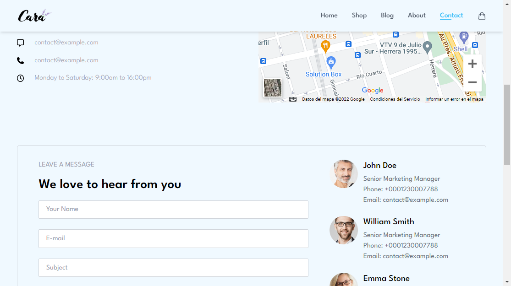
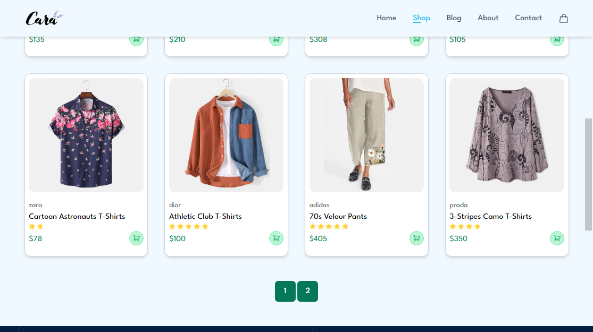
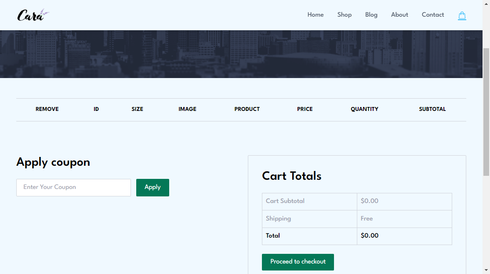

# Ecommerce App
Responsive Ecommerce App Simulator

## Installation
1. Clone a copy of the repository to your local machine.
```bash
git clone git@github.com:ariel96carp/ecommerce-dante-app.git
```

2. Use the package npm to install dependencies.
```bash
npm i
```

3. Run this repository on local environment.
```bash
npm run dev
```
***[UPDATE]*** __In order to be able to fetch data locally, you must run the script:__
```bash
npm run netlify-dev
```

4. *[optional]* You can build a dist with the command:
```bash
npm run production
```

## Overview






## Usage

In the "Apply coupon" section the valid coupons are: **B4sdED, 5Rl8f, LFs92, R46Ej**.

## Deploy
[https://ecommerce-dante-app.netlify.app](https://ecommerce-dante-app.netlify.app)
